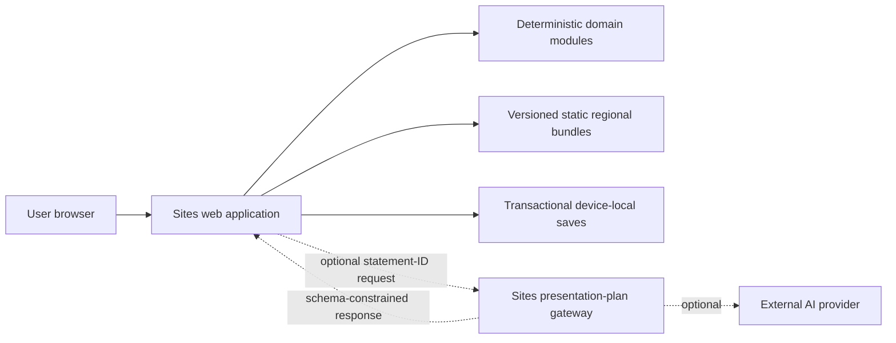
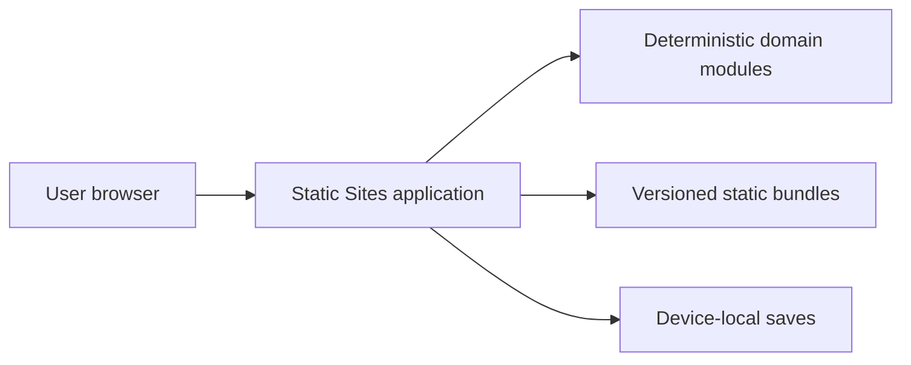
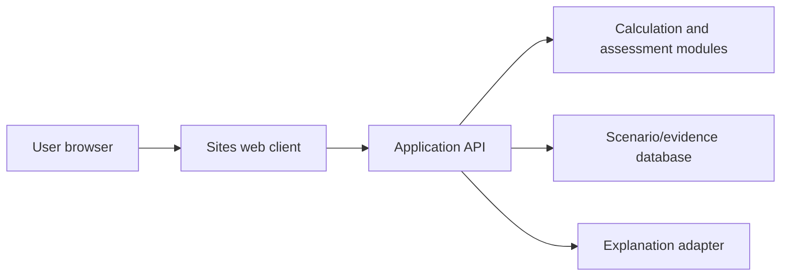

# GridLens NZ — Architecture options

**Artifact version:** 0.2  
**Status:** Re-evaluated for Gate 2 v0.2  
**Approved baseline:** Requirements 0.3 and Usage Definition 0.3  
**Normative source:** `Shared/GridLens NZ.md`

## Decision context

The architecture must deliver an anonymous, browser-first OpenAI Sites application for a short hackathon build while preserving the requirements' strongest guarantees:

- deterministic, versioned calculations and assessment rules;
- deterministic minimax workload shifting that cannot miss a feasible lower peak;
- prepared, versioned regional data and curated evidence;
- pinned geometry for Southland, Waikato, and Auckland plus reproducible evidence freshness;
- immediate results that survive evidence or AI failure;
- traceability from every material statement to an input, formula, assumption, or source;
- trusted origin derivation, per-result version manifests, and conservative evidence-first category outcomes;
- transaction-safe same-device saves across concurrent tabs, migrations, and crash reconciliation;
- accessible maps, charts, tables, comparisons, and reports;
- no server-side scenario persistence, user accounts, proposal upload, conversational assistant, or live-web retrieval in this MVP;
- strict isolation under `design-1-browser-first/` while `Shared/` remains read-only.

## Common evaluation criteria

Scores use 1 (poor) through 5 (strong). Weighted totals are out of 100.

| Criterion | Weight | What is being judged |
|---|---:|---|
| Requirements and safety fit | 25% | Determinism, provenance, failure isolation, unsupported-region gating, structured AI boundary. |
| Hackathon delivery speed | 20% | Time to a credible, demonstrable, tested release. |
| User experience and performance | 15% | Instant recalculation, responsive charts, accessible flow, graceful degradation. |
| Maintainability and testability | 15% | Independent domain tests, replaceable data, stable contracts, comprehensible ownership. |
| Operational simplicity and cost | 10% | Services, deployment, monitoring, data administration, variable cost. |
| Privacy and security | 10% | Anonymous use, minimal data movement, secret handling, untrusted-content boundary. |
| Portability and evolution | 5% | Migration toward Design 2 or future server persistence without domain rewrites. |

## Option A — Browser-first hybrid with optional presentation-plan gateway

### Topology

### Components and ownership

- The browser owns scenario state, trusted-origin derivation, validation, calculations, minimax shifting simulation, deterministic evidence freshness and assessment, evidence selection, comparison, report templates, and transactional local saves.
- Immutable regional manifests, demand profiles, water factors/thresholds, assessment policy, pinned geometry, and evidence records ship as independently versioned static assets.
- A narrow edge endpoint may optionally return only an allowlisted presentation plan: deterministic statement IDs, ordering, and non-factual connective choices. It never writes or paraphrases facts, calculates, assesses, retrieves arbitrary web content, or stores scenarios.
- When the endpoint is absent, delayed, malformed, or unavailable, deterministic templates remain the complete product path.

### Contracts and consistency

- Build-time and runtime schemas protect regional bundles and saved scenarios.
- Analysis produces an immutable result snapshot with per-result status and a complete manifest of formula, simulation, profile, factor, threshold, geometry, evidence, freshness, and assessment-policy versions.
- Optional presentation-plan requests contain a result fingerprint and allowlisted statement IDs; factual free text, unknown IDs, or stale generations are rejected.
- IndexedDB saves use per-record transactions, stable operation IDs, revisions, and tombstones. They retain normalized inputs and source versions for drift reporting, not cached authoritative outputs; restore migrates, revalidates, and recalculates.

### Trust and security

- User input, IndexedDB records, regional asset responses, and AI responses are all schema-validated before use. Trust labels are derived from current application actions and immutable references rather than accepted from persisted or editable labels.
- Provider secrets exist only in the Sites runtime environment.
- Deterministic text renders as inert text/structured blocks, never unsanitized HTML; AI output cannot supply factual prose.
- The optional gateway receives no identity and no proposal documents; external AI processing is disclosed when enabled.

### Failure, operations, and observability

- A broken global geometry/manifest blocks coordinate selection but preserves list-based diagnostics; a broken regional bundle disables only that region.
- A metric failure returns a typed partial result; unrelated metrics remain visible.
- AI timeout/error falls back to deterministic prose without changing assessments.
- Privacy-preserving diagnostics record category, component/version, correlation ID, and timing without raw scenario content.
- One Sites deployment contains static assets and an optional Worker-compatible endpoint; rollback is deployment-level.

### Build, test, package, and evolution

- Unit/property tests cover domain logic and the minimax oracle; schema/contract tests cover data, geometry, evidence freshness, persistence migrations/concurrency, and the optional endpoint; browser tests cover journeys, accessibility, copy, multi-tab local saves, and service failure.
- The production artifact is a Cloudflare Worker-compatible Sites bundle with no database or object-store dependency.
- Stable domain and data contracts can later be reused behind an API-backed Design 2.

### Cost and limits

- Static traffic is inexpensive; the only variable cost is optional AI usage, which can be disabled or bounded.
- Region/evidence updates require a tested rebuild and deployment.
- This option does not provide cross-device sharing, central curation UI, or live evidence ingestion; those are deferred requirements.

## Option B — Entirely static deterministic application

### Topology

### Components and ownership

- All Option A browser modules remain, but no server/edge endpoint exists.
- Technical and plain-language reports are assembled exclusively from deterministic templates and curated text fragments.
- All source and evidence content must be present at build time.

### Contracts, trust, and failure

- Static and local schemas are the only external contracts.
- No secret or external processing boundary exists, producing the smallest attack surface and strongest offline-style degradation.
- Deployment/data failure and IndexedDB failure behave as in Option A.

### Operations, testing, packaging, and evolution

- One static deployment, minimal monitoring, no variable AI cost.
- Testing is simpler because output text is deterministic and snapshot-testable.
- Adding AI-selected presentation planning later introduces a new server trust boundary and contract, so the initial architecture is less representative of the intended controlled-AI evolution.

### Requirements satisfied poorly

- It meets the approved requirement that reports remain useful without AI, but provides no AI-assisted presentation-planning path at all.
- It makes future controlled AI enrichment a larger architectural addition rather than an already-isolated adapter.

## Option C — API-backed modular monolith

### Topology

### Components and ownership

- The browser owns presentation and draft input only.
- A backend owns calculations, version resolution, evidence queries, reports, audit records, and optional AI orchestration.
- A database or service-owned store holds regional/evidence data and may store scenarios.

### Contracts, trust, and consistency

- A versioned public API becomes authoritative; server transactions provide central consistency and auditability.
- Authentication/authorization becomes necessary for administration and possibly saved scenarios.
- The browser can retain a fallback calculator, but doing so creates dual-execution consistency work.

### Failure, operations, testing, and packaging

- Central service failure threatens the primary analysis journey unless an explicit offline/fallback engine is duplicated.
- Requires API deployment, storage provisioning, migrations, backup/restore, access control, monitoring, and higher integration-test scope.
- Strongest path for multi-user persistence, live curation, proposal uploads, and shareable scenarios after the MVP.

### Requirements satisfied poorly

- Adds operational and privacy scope that the approved anonymous/local MVP does not require.
- Slower to deliver for the hackathon and risks violating the immediate-results failure boundary.
- This architecture is intentionally being explored separately as Design 2 and must not share project files with Design 1.

## Weighted comparison

| Criterion | Weight | Option A | Option B | Option C |
|---|---:|---:|---:|---:|
| Requirements and safety fit | 25 | 5 | 3 | 5 |
| Hackathon delivery speed | 20 | 4 | 5 | 2 |
| User experience and performance | 15 | 5 | 5 | 3 |
| Maintainability and testability | 15 | 4 | 3 | 5 |
| Operational simplicity and cost | 10 | 4 | 5 | 2 |
| Privacy and security | 10 | 4 | 5 | 3 |
| Portability and evolution | 5 | 4 | 3 | 5 |
| **Weighted total / 100** | **100** | **88** | **82** | **72** |

## Version 0.3 requirements impact

The revised requirements do not transfer authoritative ownership away from the browser, add central persistence, or require live data. They therefore do not change the option ranking. They do make Option A's internal boundaries stricter:

- the optional AI adapter becomes a presentation-plan selector rather than a prose overlay;
- local persistence requires transactional IndexedDB semantics rather than a single local-storage blob;
- map geometry, assessment policy, water thresholds, evidence freshness, and the complete reproducibility manifest become explicit versioned bundle contracts;
- the simulator requires a deterministic minimax optimizer and a frozen counterexample oracle;
- trusted-origin derivation must be outside persisted/user-controlled fields.

Option B remains viable if optional AI is removed entirely. Option C remains justified only by future central/shared/private-data requirements, not by the approved v0.3 corrections.

## Recommendation

Choose **Option A**. It preserves the user-selected browser-first design while creating one explicit, optional boundary for AI-selected presentation ordering. Deterministic analysis, evidence display, factual report statements, and reports remain complete in the browser. It has slightly more work than Option B but avoids retrofitting a security-sensitive AI boundary later. Option C becomes preferable only when central persistence, authenticated administration, live evidence ingestion, proposal processing, or cross-device sharing becomes approved scope.

## User selection history

The user selected Design 1 before Gate 1 and instructed that it remain isolated in its own directory. Option A is the architecture-level interpretation of that selection. Gate 2 v0.2 reapproval is required for the amended topology and consequences documented in `04-selected-architecture.md`.
