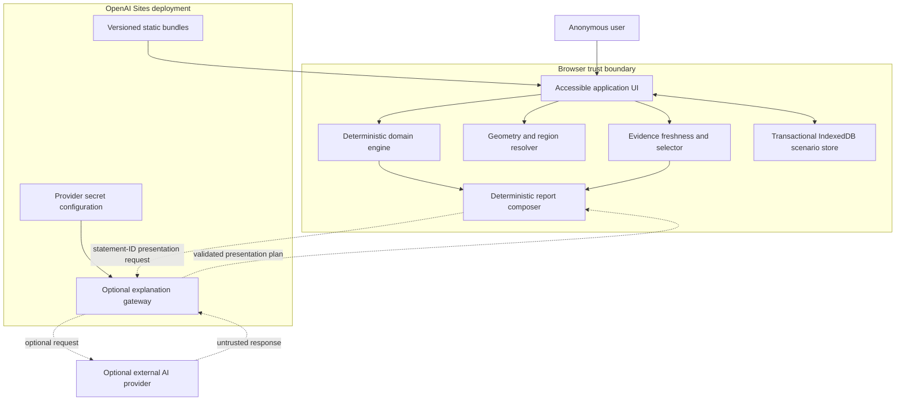

# GridLens NZ — Selected architecture: browser-first hybrid

**Artifact version:** 0.2  
**Status:** Approved at Gate 2 v0.2 on 2026-08-06  
**Selected option:** Option A from `03-architecture-options.md`  
**Approved inputs:** Requirements 0.3 and Usage Definition 0.3

## Decision

GridLens NZ Design 1 will be a browser-first OpenAI Sites application. The browser owns every authoritative and required behavior: trusted-origin derivation, scenario validation, deterministic calculations, minimax workload-shifting simulation, evidence freshness, conservative assessment rules, curated evidence selection, comparisons, technical/plain-language factual report composition, and explicit transactional device-local saves.

Prepared regional data, pinned map geometry, profiles, factors, thresholds, policies, and evidence ship as immutable, schema-validated, independently versioned static bundles. A narrow Sites edge gateway may optionally choose ordering among allowlisted deterministic statement IDs and non-factual connective slots through an external AI provider. It cannot author or paraphrase factual text. This gateway is non-authoritative, stateless, schema-constrained, and never required to complete analysis or generate a usable brief.

No database, app-owned authentication, proposal upload, community-feedback collection, conversational assistant, live-web retrieval, or cloud scenario persistence exists in this MVP.

## System context and trust boundaries



Solid paths are required product behavior. Dashed paths are optional enrichment; removing the entire optional path leaves all approved acceptance journeys intact.

## Component boundaries

| ID | Component | Responsibility and owned state | Key requirements |
|---|---|---|---|
| CMP-WEB-01 | Application shell and workflow coordinator | Owns current route/stage, in-memory draft, immutable result snapshots, comparison selection, loading/error presentation. | FR-RES-001, FR-CMP-001, FR-ERR-001 |
| CMP-UI-01 | Accessible map, forms, charts, tables, result panels, and brief views | Renders semantics and interactions; owns no calculation, origin, geometry, evidence, or assessment truth. | FR-LOC-001–002, FR-SCN-001–003, FR-RES-002–003, NFR-ACC-001 |
| CMP-VAL-01 | Scenario validator and trusted-origin derivation | Validates units/ranges and creates normalized `ScenarioInput`; assigns origins only from current trusted preset/source-reference actions, never editable/persisted labels. | FR-SCN-002–003, NFR-SEC-001 |
| CMP-CAL-01 | Deterministic calculation engine | Owns formulas, internal units, precision rules, per-result status, complete reproducibility manifests, and typed partial metric errors. | FR-CAL-001, FR-CAL-004–006, NFR-REL-001 |
| CMP-FLX-01 | Deterministic minimax flexibility optimizer | Owns baseline/shifted series, movement ledger, active constraints, optimal peak target, energy conservation, and algorithm version. | FR-CAL-002–003, FR-CAL-007, NFR-REL-001 |
| CMP-ASM-01 | Assessment and missing-information engine | Owns approved electricity/water/resilience/economic/community policy, conservative evidence gates, deterministic overall precedence, reasons, unresolved questions, and policy version. | FR-CRT-001, FR-ASM-001–008 |
| CMP-GEO-01 | Geometry and supported-region resolver | Owns pinned New Zealand geometry, deterministic point-in-polygon/border rules, and parity among coordinates, pointer, keyboard, map, and list selection. | FR-LOC-001–002, FR-DAT-001–002 |
| CMP-DATA-01 | Regional bundle loader and validator | Loads manifests, profiles, factors, thresholds, evidence, policies, and geometry; validates cross-version references; isolates invalid region bundles; pins every constituent version. | FR-LOC-002, FR-EVD-003–004, FR-DAT-001–002, FR-ERR-001 |
| CMP-EVD-01 | Curated evidence freshness and selector | Classifies each expected category as current/stale/unknown/missing against the pinned bundle `as-of` date and returns typed provenance records. | FR-EVD-001–004 |
| CMP-RPT-01 | Deterministic impact brief composer | Produces complete factual technical/plain-language briefs from allowlisted statement templates and optionally applies a validated presentation plan containing IDs/order/non-factual connectives only. | FR-RPT-001–003, NFR-EXP-001 |
| CMP-SAVE-01 | Transactional local scenario repository | Uses IndexedDB per-record transactions, revisions, operation IDs, and tombstones for save/restore/delete; runs sequential migrations, reports drift, and quarantines invalid records independently. | FR-LOCALSAVE-001–002, NFR-PRI-001 |
| CMP-AI-01 | Optional presentation-plan client | Creates minimal statement-ID requests, applies generation-bound timeout/cancellation, accepts only validated ID/order/connective plans, and exposes fallback status. | FR-RPT-003, FR-ERR-001, NFR-MNT-002, NFR-PRI-001 |
| CMP-EDGE-01 | Optional presentation-plan gateway | Holds provider secret, validates request/response, rejects factual free text and unknown IDs, rate-limits, times out, and stores no scenario. | FR-RPT-003, NFR-SEC-001–002, NFR-MNT-002 |
| CMP-OBS-01 | Privacy-preserving diagnostics | Produces component/version/category/timing/correlation events without raw scenario or generated prose. | NFR-OBS-001 |

## Data ownership and consistency

| Data | Authoritative owner | Persistence | Consistency/version rule |
|---|---|---|---|
| Scenario draft | Application shell | Memory only | Editable and never treated as calculated output. |
| Normalized scenario input | Validator | Result snapshot; optional IndexedDB save | Schema version and origin proof on every field. User edits are assumptions; preset/source origins require valid immutable references and are re-derived on restore. |
| Calculation records | Calculation engine | Immutable in-memory result snapshot | Pin exact inputs, units, unrounded/display value, per-result status/error, and the complete constituent-version manifest. |
| Hourly simulation | Minimax flexibility optimizer | Immutable in-memory result snapshot | Pin algorithm/profile/constraint versions; preserve daily energy and prove the reported peak target is feasible and minimal under approved constraints. |
| Evidence status set | Evidence freshness/selector | Immutable in-memory result snapshot | One explicit current/stale/unknown/missing record per expected category, evaluated against pinned `as-of` and `validUntil`. |
| Assessment | Assessment engine | Immutable in-memory result snapshot | Pin policy/threshold versions, exact deterministic inputs, ordered reasons, qualifying evidence IDs, and missing-information IDs. |
| Regional bundle | Static asset set | Sites immutable deployment assets | Manifest independently pins schema, bundle, profile, factor, threshold, evidence, freshness-policy, assessment-policy, and geometry versions; invalid cross-version graphs are not activated. |
| Pinned geometry | Static global bundle | Sites immutable deployment assets | Geometry version and deterministic region-ID mapping; exact border ties choose lexicographically smallest matching ID. |
| Curated evidence | Static regional bundle | Sites immutable assets | Stable evidence ID, category, publication date, optional `validUntil`, full provenance, and quality; no arbitrary internet content. |
| Saved scenario/tombstone | Local scenario repository | IndexedDB after explicit action | Per-record transaction, stable operation ID, revision, schema/source versions, and monotonic tombstone; sequential migration or individual quarantine on restore. |
| Presentation plan | Report composer after gateway validation | Ephemeral memory only | Must match active result fingerprint/request generation and contain only supplied statement IDs, ordering, and allowlisted non-factual connective choices. |
| Diagnostics | Diagnostics adapter/runtime log | Ephemeral or host log | No raw scenario inputs, evidence excerpts, saved labels, or generated prose. |

The architecture intentionally does not cache authoritative calculated results in IndexedDB. A restored scenario is migrated, revalidated, and recalculated with currently loaded versions, and the UI must disclose every source-version difference from the save-time manifest. An old tab cannot resurrect a tombstoned record or silently overwrite a newer revision.

## High-level contracts

The full typed definitions and failure semantics will be frozen in `05-contracts.md`. Architecture reserves these boundaries:

| Contract | Producer | Consumers | Versioning/failure rule |
|---|---|---|---|
| `DeploymentManifest` / `RegionBundle` / `GeometryBundle` | Build-time curated data | Bundle loader, geometry resolver, evidence selector, simulator, assessment | Explicit compatible schema/constituent versions; invalid cross-reference graph rejected globally or per region according to ownership. |
| `ScenarioDraft` / `ScenarioInput` / `OriginProof` | UI / validator | Calculation, simulator, assessment, save repository | Invalid drafts never cross into calculation; origin proof is derived from trusted actions and revalidated, never accepted from labels. |
| `CalculationBundle` / `ResultStatus` / `ReproducibilityManifest` | Calculation engine | Assessment, report, UI | Complete/insufficient/failed results are explicit; partial typed failures permitted; no fabricated fallback values; every consumer receives full versions. |
| `SimulationBundle` / `MovementLedger` | Minimax flexibility optimizer | Assessment, report, charts | Conservation, flexible-load, destination headroom/utilisation, original-peak, deterministic tie-break, and optimal-target invariants mandatory. |
| `EvidenceItem` / `EvidenceCategoryStatus` | Curated bundle / freshness selector | Assessment, report, UI | Stable provenance; exact pinned-date freshness; one explicit status per expected category; missing references invalidate only dependent statements. |
| `AssessmentBundle` / `AssessmentTrace` | Assessment engine | Report and results UI | Each non-insufficient outcome names deterministic inputs, policy/threshold versions, reasons, and qualifying current evidence; overall precedence is fixed. |
| `ResultSnapshot` | Workflow coordinator | Comparison, report, optional presentation gateway | Immutable and fingerprinted from normalized inputs, per-result statuses, evidence statuses, and complete pinned versions. |
| `SavedScenarioEnvelope` / `SaveOperation` / `ScenarioTombstone` | Local repository | Workflow coordinator | Transactional compare-and-swap by revision; idempotent operation ID; sequential migrations; individual quarantine; tombstones prevent resurrection. |
| `PresentationPlanRequest` / `PresentationPlan` | Report client / edge gateway | Edge gateway / report composer | Strict JSON schema, allowlisted statement/order/connective choices, timeout/cancellation, no factual free text/HTML, result-fingerprint and request-generation match. |
| `DiagnosticEvent` | Any component through diagnostics adapter | Browser/host diagnostic sink | Structured allowlist; privacy fields forbidden. |

## Required control and data flows

### 1. Startup and region activation

1. Load the application shell, deployment manifest, pinned geometry, and supported-region index.
2. Validate schemas, exact required Southland/Waikato/Auckland records, geometry integrity, region IDs, and constituent-version compatibility before enabling map/coordinate selection.
3. Resolve pointer/coordinate inputs with deterministic point-in-polygon; border ties choose the lexicographically smallest matching region ID; list and keyboard controls select the same canonical ID.
4. On selection, load only the selected region bundle.
5. Validate all cross-references, units, profile lengths, factor/threshold ranges, evidence categories/dates, pinned `as-of` date, and compatible versions.
6. Activate a complete bundle atomically; on failure, mark only that region unavailable and retain other valid regions. Never substitute a nearest supported region.

### 2. Analyse scenario

1. UI submits a draft to the validator.
2. Validator returns blocking errors, warnings, or normalized input with re-derived `OriginProof` records; untrusted/persisted origin labels are discarded.
3. Calculation engine returns typed complete/insufficient/failed calculation records plus constituent versions.
4. Minimax optimizer returns baseline/shifted profiles, movement ledger, active constraints, and the feasible minimal combined-peak target using deterministic tie-breaks.
5. Evidence selector returns relevant curated evidence and one current/stale/unknown/missing record for every expected category against the pinned `as-of` date.
6. Assessment engine applies the approved five-category rules and overall precedence, returning outcomes, exact traces, qualifying evidence, and missing information.
7. Coordinator freezes the combined data and complete reproducibility manifest as a fingerprinted immutable result snapshot.
8. UI and deterministic report composer render immediately; optional presentation-plan enrichment starts afterward and cannot add or paraphrase facts, change values/outcomes, or outlive the active request generation.

### 3. Compare scenarios

Each side owns an immutable result snapshot. Comparison is a pure operation over compatible records; it never mutates the baseline. Invalid edits display a stale-result state until a new valid snapshot succeeds.

### 4. Save and restore

Save is explicit and device-local. The repository uses one IndexedDB transaction per record mutation, compare-and-swap revisions, stable idempotent operation IDs, and monotonic tombstones. Independent records saved from concurrent tabs both survive; conflicting same-record revisions are surfaced rather than silently overwritten. Restore runs supported sequential migrations, validates the envelope and trusted references, loads the current bundle, recalculates, and reports every version drift. Invalid records are quarantined individually. After an indeterminate crash, retrying the same operation ID reconciles the committed outcome. Storage denial/quota errors leave the active in-memory scenario untouched.

### 5. Optional explanation

The client sends only the active result fingerprint, current request-generation ID, allowlisted deterministic statement IDs with non-authoritative presentation metadata, requested audience, and disclosure version. It sends no factual free-text replacement slot. The gateway validates input, calls the configured provider under strict limits, validates output as an ID/order/non-factual-connective presentation plan, and returns it. The browser reconstructs all factual prose from deterministic templates. Any factual free text, unknown/duplicate/missing required ID, invalid connective, error, timeout, cancellation, fingerprint mismatch, or obsolete generation discards the plan and preserves deterministic prose.

## Deployment topology and lifecycle

- One isolated Sites project lives entirely below `design-1-browser-first/`.
- The Sites build produces Cloudflare Worker-compatible ESM output, static application assets, deployment/geometry/region manifests with immutable content hashes, and the optional edge route.
- No D1/R2/database/authentication resource is declared for this MVP.
- Runtime provider configuration is managed by Sites and never committed or embedded in browser bundles.
- Deployment is atomic. A dataset or code update is a new versioned deployment; rollback restores the previous complete code/data set.
- Saved local scenarios are forward-read through explicit sequential IndexedDB schema/data migrations only. Each migration is transactional and idempotent; records without a supported path or with invalid post-migration content are quarantined individually and deletable.
- Unpublishing/removing the deployment does not delete browser-local saves; the product documents an explicit local delete control and browser-storage clearing path.

## Security and privacy model

1. Validate every trust-boundary payload, including bundled JSON, geometry, IndexedDB records, and optional gateway messages.
2. Use no runtime HTML injection path for evidence or generated text.
3. Treat evidence excerpts and AI output as content, never instructions; never place evidence text in a prompt-as-instruction role.
4. Restrict the optional gateway to fixed presentation-plan operations; no user-authored prompt, factual replacement text, or open-ended chat endpoint.
5. Keep provider secrets server-side; use request size, timeout, rate, and output-size limits.
6. Disclose optional external AI processing and transmit no identity, local-save label, or unnecessary scenario field.
7. Apply a restrictive content security policy and dependency review during implementation/QA.
8. Keep diagnostics free of raw user content and sensitive configuration.
9. Derive trust origins from active application actions and immutable bundle references; treat editable fields, URLs, local records, and browser-controlled state as untrusted regardless of claimed origin.
10. Use deployment content hashes and same-origin fetches for integrity correlation; schema/content validation remains mandatory because browser-delivered data is not a privileged authority boundary.
11. Treat result fingerprints as reproducibility/correlation identifiers, not signatures. A copied brief describes evidence validated by this deployment version but does not claim tamper-proof third-party attestation.

## Failure containment and recovery

| Failure | Containment | User-visible recovery |
|---|---|---|
| Manifest or selected region bundle invalid | Do not activate affected bundle; other regions remain usable. | Explain unavailable regional data and allow another region/retry. |
| Geometry invalid or map/list region IDs disagree | Disable coordinate/map resolution; do not guess or select nearest; retain equivalent list diagnostics only when its canonical index is independently valid. | Explain mapping data failure and offer retry/another validated selection path. |
| One metric cannot calculate | Typed failure only for that metric. | Show missing/invalid dependency and keep unrelated results. |
| Simulation profile incompatible or optimizer invariant fails | Electricity totals remain available; simulation and electricity peak assessment are failed/incomplete, never replaced with a greedy estimate. | Explain profile/algorithm issue and omit no facts silently. |
| Evidence missing/stale/unknown or threshold absent | Deterministic calculations remain complete; dependent assessment becomes insufficient according to policy. | Display explicit category status, age basis, missing thresholds, and questions. |
| IndexedDB unavailable/quota/corrupt record | Keep memory state; abort failed transaction; quarantine only the corrupt record. | Continue session, show conflict/failure, and offer delete/manual recovery guidance. |
| Concurrent save/delete conflict or indeterminate completion | Do not silently overwrite or resurrect; compare revision/tombstone and reconcile by operation ID. | Preserve committed state and ask the user to retry/refresh when a same-record conflict needs choice. |
| Optional gateway/provider timeout, obsolete generation, or malformed/factual output | Discard presentation plan; deterministic report unchanged. | Mark enrichment unavailable and optionally retry without blocking. |
| Deployment regression | Atomic rollback to prior deployment. | Operator verifies representative journey after rollback. |

## Performance and resource model

- Calculations, assessment, and comparison execute locally and target the approved sub-one-second result budget.
- Load the app shell and manifest first; load a single regional bundle on demand.
- Charts derive from bounded 24-hour arrays. The minimax optimizer uses a monotone feasibility search and deterministic allocation over fixed-size hourly vectors; exact complexity and numeric tolerances are frozen in the logic phase and tested against an independent oracle, including the 100/50/50 counterexample.
- Evidence freshness/selection operates over the selected region's bounded curated collection and expected-category index, not an unbounded corpus or browser clock.
- Optional AI work begins only after the deterministic snapshot renders and uses a strict timeout/cancellation path.
- Build validation enforces explicit bundle/file-size, geometry-vertex, evidence-count, and migration-step budgets defined in the logic/test phase so new data cannot silently degrade the five-second initial-analysis target.

## Observability and operations

- Diagnostic events use stable category/component/version/correlation fields and exclude scenario contents.
- Browser performance marks cover bundle/geometry load, validation, calculation, minimax simulation, freshness classification, assessment, persistence operations, and first deterministic render.
- Optional edge logs cover validation outcome, provider latency/status, factual-text/schema rejection, obsolete-generation discard, and fallback rate without request/response prose.
- A build-time manifest report records every constituent version/hash, regional/evidence/threshold/geometry counts, validation status, source-link status, and asset sizes.
- Release verification runs the Southland scenario, all three region-selection paths, frozen minimax oracle, freshness/assessment boundaries, partial failure, concurrent local-save/delete, migration/quarantine, and AI-disabled/malicious/late-response paths.

## Testing strategy at architecture level

- **Unit/property:** formulas, unit conversions, ranges, rounding, minimax optimality/conservation/all constraints, pinned-date freshness, all category/overall assessment branches, deterministic geometry border rules, and sequential migrations.
- **Schema/contract:** deployment/geometry/regional bundles, cross-version references, water thresholds, evidence dates/categories, reproducibility manifests, saved envelopes/operations/tombstones, presentation-plan request/response, and diagnostic allowlist.
- **Integration:** three-region activation/parity, partial calculation failure, report traceability, restore/recalculate/full version drift, concurrent-tab persistence, indeterminate-write reconciliation, migration/quarantine, and gateway fallback/stale-generation discard.
- **End-to-end:** UJ-001 through UJ-011 where applicable, including Southland exact values, the 100/50/50 minimax oracle, category policy boundaries, and comparison.
- **Accessibility:** automated checks plus keyboard, screen-reader semantics, zoom, non-colour outcome, chart table/text equivalence.
- **Security/failure injection:** forged origin labels, inert malicious text, corrupt local records, malformed bundles/geometry, unknown or factual AI output, obsolete response, timeout, oversized payload, and missing secret.
- **Packaging:** production Sites build, secret/local-path scan, clean deployment smoke, rollback/removal instructions.

## Project boundary and proposed source layout

The exact scaffold is deferred until the implementation gate. The architectural ownership map is:

```text
design-1-browser-first/
  .autoforge/                 approved design and verification record
  app/                        Sites routes, shell, and optional edge route
  src/domain/                 validation/origin, calculation, minimax simulation, evidence freshness, assessment, geometry
  src/application/            workflow, snapshots, comparison, report composition
  src/adapters/               bundle, transactional IndexedDB, optional presentation plan, diagnostics
  src/ui/                     accessible product components and visualisations
  public/data/                versioned deployment/geometry/region/evidence/policy bundles
  schemas/                    machine-validated boundary schemas
  tests/                      unit, property, contract, integration, end-to-end fixtures
```

No file outside this root is implementation-owned. `Shared/` is read-only and `Shared/GridLens NZ.md` is the sole normative source.

## Requirement-to-architecture traceability

| Requirement IDs | Primary components/decisions |
|---|---|
| FR-LOC-001, FR-LOC-002 | CMP-UI-01, CMP-GEO-01, CMP-DATA-01, ADR-003 |
| FR-SCN-001, FR-SCN-002, FR-SCN-003 | CMP-UI-01, CMP-VAL-01 and `OriginProof` trust boundary |
| FR-CAL-001, FR-CAL-002, FR-CAL-003, FR-CAL-004, FR-CAL-005, FR-CAL-006, FR-CAL-007 | CMP-CAL-01, CMP-FLX-01, complete `ReproducibilityManifest`, ADR-002 |
| FR-EVD-001, FR-EVD-002, FR-EVD-003, FR-EVD-004 | CMP-DATA-01, CMP-EVD-01, pinned bundle `as-of`, ADR-003 |
| FR-CRT-001, FR-ASM-001, FR-ASM-002, FR-ASM-003, FR-ASM-004, FR-ASM-005, FR-ASM-006, FR-ASM-007, FR-ASM-008 | CMP-ASM-01, evidence/threshold gates, fixed overall precedence, ADR-002/ADR-003 |
| FR-CMP-001 | CMP-WEB-01 and immutable `ResultSnapshot` |
| FR-RES-001, FR-RES-002, FR-RES-003 | CMP-WEB-01, CMP-UI-01 |
| FR-RPT-001, FR-RPT-002, FR-RPT-003 | CMP-RPT-01, CMP-AI-01, CMP-EDGE-01, statement-ID-only presentation plan, ADR-002 |
| FR-ERR-001 | Typed partial results, region isolation, deterministic report fallback |
| FR-DAT-001, FR-DAT-002 | CMP-GEO-01, CMP-DATA-01, deployment/geometry manifests, schema and cross-version validation, ADR-003 |
| FR-LOCALSAVE-001, FR-LOCALSAVE-002 | CMP-SAVE-01, IndexedDB transaction/revision/operation/tombstone/migration model, ADR-004 |
| NFR-PER-001, NFR-PER-002 | Local domain execution, lazy region loading, post-render optional AI |
| NFR-REL-001, NFR-REL-002 | Complete reproducibility manifests, immutable snapshots, pure domain functions, typed per-result status/failures |
| NFR-ACC-001 | CMP-UI-01 and accessibility test gate |
| NFR-SEC-001, NFR-SEC-002 | Validation at every boundary, inert rendering, constrained edge gateway |
| NFR-PRI-001 | Anonymous use, local-only saves, data-minimal optional gateway, ADR-004 |
| NFR-EXP-001 | Calculation/evidence records and traceable report composer |
| NFR-MNT-001, NFR-MNT-002 | Separated modules/contracts and statement-ID-only schema-constrained AI adapter |
| NFR-DEP-001 | Sites deployment topology and Worker-compatible ESM build |
| NFR-OBS-001 | CMP-OBS-01 and diagnostic allowlist |
| CON-001 | All implementation ownership is under `design-1-browser-first/`. |
| CON-002 | CMP-CAL-01, CMP-FLX-01, CMP-ASM-01, ADR-002; optional AI has no authority. |
| CON-003 | CMP-DATA-01, CMP-EVD-01, ADR-003; no unrestricted live search. |
| CON-004 | Anonymous Sites topology with no database/auth; ADR-001 and ADR-004. |
| CON-005 | No upload/community submission boundary or storage exists. |
| CON-006 | Sites deployment topology and Worker-compatible ESM build. |
| CON-007 | Project boundary section and read-only normative-source rule. |

## Acceptance-criterion-to-architecture traceability

| Acceptance criterion | Architecture evidence planned |
|---|---|
| AC-001 | CMP-UI-01, CMP-GEO-01, and CMP-DATA-01 support prepared regions and atomic unsupported/unavailable gating. |
| AC-002 | CMP-UI-01 and CMP-VAL-01 provide fields, trusted origin proofs, explanations, and typed validation. |
| AC-003 | CMP-CAL-01 owns formula/version/precision/status records and the Southland golden case. |
| AC-004 | Pure CMP-CAL-01 contracts enable typical, boundary, invalid, conversion, and rounding unit tests. |
| AC-005 | CMP-FLX-01 plus CMP-UI-01 provide bounded series, accessible chart summaries, and tables. |
| AC-006 | CMP-FLX-01 owns optimality, conservation, flexible-load, destination headroom/utilisation, original-peak, and peak-reduction invariants. |
| AC-007 | ADR-003 and CMP-EVD-01 require source-backed typed evidence with quality and explicit freshness classification. |
| AC-008 | `CalculationBundle`, `EvidenceItem`, `OriginProof`, and CMP-RPT-01 preserve origin/trace links. |
| AC-009 | CMP-ASM-01 owns deterministic missing-information and evidence-gating rules without automatic rejection. |
| AC-010 | CMP-RPT-01 produces both complete views without requiring CMP-EDGE-01. |
| AC-011 | Typed partial failures and optional-presentation-plan discard paths keep deterministic results visible. |
| AC-012 | CMP-WEB-01 compares immutable `ResultSnapshot` records and changed assumptions. |
| AC-013 | Architecture-level test and deployment sections define build, contract, accessibility, and journey gates. |
| AC-014 | Security model, inert rendering, secret scan, typed failures, and ADR-002 prevent forbidden output. |
| AC-015 | CMP-UI-01 retains units/source/confidence and text/table equivalents for visual comparisons. |
| AC-016 | CMP-ASM-01 owns the exact five-category threshold/evidence branches and high→insufficient→moderate→all-low precedence. |
| AC-017 | CMP-EVD-01 and ADR-003 own pinned `as-of`, 24/36-month boundaries, `validUntil`, and stale/unknown low-concern exclusion. |
| AC-018 | CMP-FLX-01 exposes deterministic minimax feasibility/optimality and the frozen 100/50/50→125 MW oracle. |
| AC-019 | `OriginProof` plus statement-ID-only presentation plans prevent persisted/browser/AI trust forgery and late-response mutation. |
| AC-020 | CMP-GEO-01 and pinned geometry provide Southland/Waikato/Auckland parity plus deterministic exact-border fixtures. |
| AC-021 | CMP-SAVE-01's transaction/revision/operation/tombstone/migration/quarantine model covers adversarial multi-tab and crash paths. |
| AC-022 | `ReproducibilityManifest` is mandatory on complete, insufficient, and failed results and spans every constituent version. |

## Consequences and risks

### Positive

- Required analysis is fast, deterministic, anonymous, and resilient to external failure.
- Static regional bundles make demonstrations reproducible and easy to audit.
- The optional AI boundary is explicit, removable, and structurally unable to author or paraphrase facts or outcomes.
- Pinned freshness, policy, threshold, and geometry versions make complete and partial results reproducible without the browser clock.
- Transactional per-record persistence prevents silent independent-save loss and record resurrection across tabs.
- Domain contracts can migrate to an API-backed architecture without rewriting formulas or tests.

### Costs and risks

- Every regional/evidence update requires a validated deployment.
- IndexedDB is device/browser-profile-specific and user-clearable; it is not backup or sharing. Same-record conflicts are surfaced rather than silently merged.
- Large evidence bundles could harm load time unless build budgets and lazy loading are enforced.
- Client code exposes formulas and curated data, which is acceptable for transparency but unsuitable for proprietary algorithms/data.
- Optional external AI adds variable cost, provider availability, and disclosure obligations even though it is non-authoritative and limited to presentation planning.
- Static authoritative data creates a release obligation: supported bundles need current qualifying evidence and link/freshness validation, or affected outcomes/regions must remain insufficient/unavailable.
- The minimax optimizer and transactional persistence are more complex than greedy shifting and a local-storage blob; frozen independent oracles and concurrency/migration tests are mandatory before implementation is trusted.

### Conditions that would invalidate this selection

Return to the architecture gate if approved scope adds authenticated administration, central audit retention, shared scenario links, proposal uploads, community submissions, live evidence ingestion, large/private datasets, proprietary rules, or server-authoritative calculation. Those changes transfer data ownership and trust boundaries toward Option C/Design 2.

## Approval boundary

Gate 2 v0.2 approval accepts this topology, component/data ownership, minimax-optimizer boundary, pinned evidence/policy/geometry model, statement-ID-only optional AI boundary, transactional IndexedDB persistence, Sites deployment model, failure semantics, and migration consequences. It does not approve low-level schemas, algorithms, or implementation; those require revised Phase 4 logic artifacts and an independent validated verdict.
